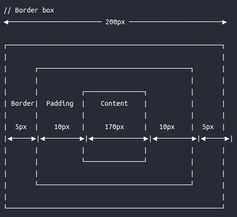
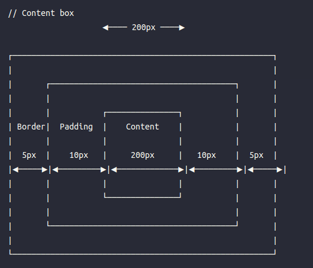

---
---

# Basic

<h2 id='syntax' class='font-bold text-gray-700 my-10'> Syntax </h2>

<h3 class='text-red-400'>basic syntax </h3>

```css
selector {
  proper: value;
}
```

for example

```css
* {
  padding: 0;
  margin: 0;
  box-sizing: border-box;
}
```

<h3 class='text-red-400'>selector </h3>

**HTML**

```css
p {
  color: red;
}
```

**class**

`<div class='text'>this is some text </div>`

**id**

id should be unique

`<div id='text'>this is some text </div>`

**\*universal**

```css
* {
  padding: 0;
  margin: 0;
  box-sizing: border-box;
}
```

<h3 class='text-red-400'>Combine Selector</h3>

### AB{ }

<p>+ => both the A and B selector on the same element , the style will work </p>
  &nbsp;
  for example:

```html
<h1 class="app">this is the text</h1>
<h1>the style will not apply to this style</h1>
```

```css
h1.app {
  color: red;
}
```

### A,B{ }

or => use comma "," elment has A or B selector will apply this style

```html
<p class="text1">text one</p>
<p class="text2">text two</p>
```

text one and text two will turn red

```css
.text1,
.text1 {
  color: red;
}
```

### A B{}

child,parent => B is a child of A element

```html
<ul>
  <li>item1</li>
</ul>
```

select all the li element which is the decendant of ul
</br>
so it could be children or grand child as long as li element is the decendent of ul will be selected

```css
ul li {
  color: red;
}
```

<h2 id='comment' class='font-bold text-gray-700 my-10'> Comment </h2>
use the shortcut key

ctrl + /

```css
h1 {
  /* color:red; */
}
```

<h2 id='color' class='font-bold text-gray-700 my-10'> Color </h2>

<h3 class='text-red-400 my-6'>rgb</h3>
red |  green  | blue  <br>

<p> red: 0~255 </p>
<p> green: 0~255 </p>
<p> blue: 0~255 </p>

```css
p {
  color: rgb(0, 0, 0);
  /* text color is pure black */
  background-color: rgb(255, 255, 255);
  /* background ispure white */
}
```

<h3 class='text-red-400 my-6'>rgba</h3>

red | green | blue | alpha <br>
The alpha parameter is a number between 0.0 (fully transparent) and 1.0 (fully opaque).

<p> red: 0~255 </p>
<p> green: 0~255 </p>
<p> blue: 0~255 </p>

```css
p {
  color: rgba(0, 0, 0, 0.5);
  background-color: rgba(255, 255, 255, 0.9);
}
```

<h3 class='text-red-400 my-6'>#hex</h3>

Hex uses three two-character codes to specify RGB values in the range 00-FF, where 00 is no color and FF is full color.

| Decimal Values                        |
| ------------------------------------- |
| 0 1 2 3 4 5 6 7 8 9 10 11 12 13 14 15 |

| HEXADECIMAL DIGITS              |
| ------------------------------- |
| 0 1 2 3 4 5 6 7 8 9 A B C D E F |

#FFFFFF ↔️ rgb(255,255,255)

**shorthand**

if two digits are the same , write one instead

#3333FF => #33F

<h3 class='text-red-400 my-6'>hsl</h3>

hue, saturation, and lightness.

HSL color values are specified with: hsl(hue, saturation, lightness)
Hue is a degree on the color wheel from 0 to 360. 0 is red, 120 is green, and 240 is blue.

Saturation is a percentage value. 0% means a shade of gray, and 100% is the full color.

Lightness is also a percentage value. 0% is black, and 100% is white.

<p> H: 0~360 </p>
<p> S: 0~100% </p>
<p> L: 0~100% </p>

```css
p {
  color: hsl(360, 25%, 75%);
  background-color: hsl(180, 50%, 50%);
}
```

<h3 class='text-red-400 my-6'>hsla</h3>

hsla(hue, saturation, lightness, alpha)

The alpha parameter is a number between 0.0 (fully transparent) and 1.0 (not transparent at all):

<p> H: 0~360 </p>
<p> S: 0~100% </p>
<p> L: 0~100% </p>
<p> a: 0~1.0 </p>

```css
p {
  color: hsla(360, 25%, 75%, 0.5);
  background-color: hsla(180, 50%, 50%, 0.5);
}
```

<h2 id='unit' class='font-bold text-gray-700 my-10'> Unit </h2>

<h3 class='text-red-400 my-6'>px</h3>

he absolute length units are fixed and a length expressed in any of these will appear as exactly that size.

Absolute length units are not recommended for use on screen, because screen sizes vary so much. However, they can be used if the output medium is known, such as for print layout.

the other **absolute length**

cm | mm | in | pt | pc

<h3 class='text-red-400 my-6'>rem</h3>

Rem (short for “root-em”) units dictate an element’s font size relative to the size of the root element. By default, most browsers use a font size value of 16px. So, if the root element is 16px, an element with the value 1rem will also equal 16px.

Therefore, rem units are useful for scaling CSS elements in relation to the size of the root element — even if you don’t know what the default font size will be.

however we can change the default font-size which will lead to the change of the 1rem

```css
html {
  font-size: 62.5%;

  /* changes a default 16px font size to 10px */
}

h1 {
  font-size: 2.4rem;

  /* font size = 24px */
}

h2 {
  font-size: 1.6rem;

  /* font size = 16px */
}

p {
  font-size: 1.2rem;

  /* font size = 12px */
}
```

<h3 class='text-red-400 my-6'>em</h3>

em => Relative to the font-size of the element (2em means 2 times the size of the current font)

<p class='text-[blue]'>The em and rem units are practical in creating perfectly scalable layout!</p>

sometimes it might be useful to give padding or shadow based on the current font size

<h3 class='text-red-400 my-6'>vw|vh</h3>

**vw** => view width

vh => view height

<h3 class='text-red-400 my-6'>%</h3>
0-100% based on its parent size

```css
div {
  width: 400px;
}

div p {
  width: 75%;
  /* width: 300px */
}
```

<h2 id='styles' class='font-bold text-gray-700 my-10'> Styles </h2>

in css we have three types of style

<h3 class='text-red-400 my-6'>inline style</h3>
An inline CSS is used to apply a unique style to a single HTML element.

An inline CSS uses the style attribute of an HTML element.

```html
<div style="color:red;">this is inline style</div>
```

<h3 class='text-red-400 my-6'>internal style</h3>

`Internal - by using a <style> element in the <head> section`

```html
<!DOCTYPE html>
<html>
  <head>
    <style>
      body {
        background-color: powderblue;
      }
      h1 {
        color: blue;
      }
      p {
        color: red;
      }
    </style>
  </head>
  <body>
    <h1>This is a heading</h1>
    <p>This is a paragraph.</p>
  </body>
</html>
```

<h3 class='text-red-400 my-6'>external style</h3>
An external style sheet is used to define the style for many HTML pages.

`To use an external style sheet, add a link to it in the <head> section of each HTML page:`

```html
<!DOCTYPE html>
<html>
  <head>
    <link rel="stylesheet" href="styles.css" />
  </head>
  <body>
    <h1>This is a heading</h1>
    <p>This is a paragraph.</p>
  </body>
</html>
```

<h2 id='inheritance' class='font-bold text-gray-700 my-10'> inheritance </h2>

<h3 class='text-red-400 my-6'>definition</h3>
When no value for an inherited property has been specified on an element, the element gets the computed value of that property on its parent element. Only the root element of the document gets the initial value given in the property's summary.

<p class='text-blue-500'>
normally color and fonts are set to be inherited by default
border is set to be initial 
</p>

<h3 class='text-red-400 my-6'>to stop the inheritance</h3>

```css
p {
  color: initial;
}
```

<h2 id='boxmodel' class='font-bold text-gray-700 my-10'> box model </h2>

<h3 class='text-red-400 my-6'>margin|padding</h3>
shortcut : 
we have four situations

```css
p {
  /* Apply to all four sides */
  padding: 1em;

  /* top and bottom | left and right */
  padding: 5% 10%;

  /* top | left and right | bottom */
  padding: 1em 2em 2em;

  /* top | right | bottom | left */
  padding: 5px 1em 0 2em;
}
```

<h3 class='text-red-400 my-6'>border & border-width</h3>

```css
p {
  border: 1px solid black;
  /* border width =1px all around */
  border-width: 1px 2px 0px 0.5px;
  /* we can also specify the 
  border with ourselves 
  top right bottom left */
}
```

<h3 class='text-red-400 my-6'>box-sizing</h3>
we have two types of box-sizing

```css
.box {
  box-sizing: border-box;
}
```

<!--  -->
<!--  -->

```css
.box {
  box-sizing: content-box;
}
```

<!--  -->

<h2 id='specificity' class='font-bold text-gray-700 my-10'> specificity </h2>

Lorem ipsum dolor sit amet consectetur adipisicing elit. Voluptatum quis
vel magnam, error reprehenderit nihil, veniam rem aspernatur cupiditate
temporibus, repellendus sapiente quas deleniti iure! Omnis sed labore
optio tenetur. Ratione voluptates neque animi off

<h2 id='pseudoclass' class='font-bold text-gray-700 my-10'> pseudoclass </h2>

Lorem ipsum dolor sit amet consectetur adipisicing elit. Voluptatum quis
vel magnam, error reprehenderit nihil, veniam rem aspernatur cupiditate
temporibus, repellendus sapiente quas deleniti iure! Omnis sed labore
optio tenetur. Ratione voluptates neque animi off

```

```

```

```
